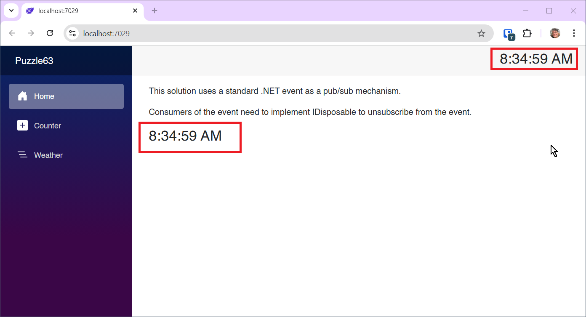

# Blazor Puzzle #63

## There Can Only Be One

YouTube Video: https://youtu.be/b-cqci6w3-g

Blazor Puzzle Home Page: https://blazorpuzzle.com

### The Challenge:

This app illustrates how there can only be one EventCallback handler of a Cascading component.

The `MyCascadingComponent` cascading parameter is accessed in both *Home.razor* and *Toolbar.razor*.

An EventCallback is created in both places, but there is only one, so the last one to be defined wins. That turns out to be in Home.razor

To test it, comment out the line in `OnInitialized` where `MyEventCallback` is created.

How can we support multiple callbacks?

### The Solution:

There are a few ways to achieve this. The one we chose was to create a standard C# event inside `MyCascadingComponent`:

```c#
public event Action<string> OnChange;
```

To raise the event, we expose a private method:

```c#
private void NotifyStateChanged(string value) => OnChange?.Invoke(value);
```

Then when we want to raise the event, we can do so like this:

```c#
NotifyStateChanged("My String Value");
```

This means that consumers of `MyCascadingComponent` that want to subscribe to the event, must also unsubscribe when disposed, so they must implement `IDisposable`:

```c#
@implements IDisposable 
```

To subscribe:

```c#
protected override void OnInitialized()
{
    CascadingComponent.OnChange += HandleMyEventCallback;
}
```

To unsubscribe:

```c#
public void Dispose()
{
    CascadingComponent.OnChange -= HandleMyEventCallback;
}
```


